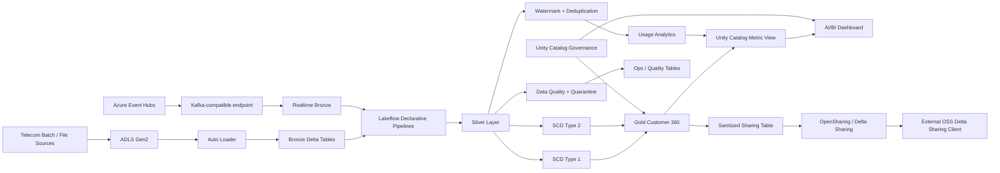

# Enterprise Telecom Customer 360 & Revenue Intelligence Platform

[](https://github.com/Vishnu567456/azure-telecom-customer360/actions/workflows/ci.yml)

An end-to-end Azure Databricks Lakehouse project for a synthetic telecom environment, covering incremental batch ingestion, Azure Event Hubs realtime ingestion, CDC, SCD processing, streaming, data quality, governance, semantic metrics, AI/BI analytics, OpenSharing / Delta Sharing, Databricks Declarative Automation Bundles, and automated CI validation.

> **Data safety:** All customer, subscription, billing, usage, and digital-event data used in this repository is synthetic. No employer, client, or production data is included.

## Architecture



## Technology Stack

- Microsoft Azure
- Azure Data Lake Storage Gen2
- Azure Event Hubs
- Azure Databricks
- Apache Spark / PySpark
- Delta Lake
- Unity Catalog
- Databricks Auto Loader
- Lakeflow Declarative Pipelines
- Structured Streaming
- Lakeflow Jobs
- Unity Catalog Metric Views
- AI/BI Dashboards
- OpenSharing / Delta Sharing
- Databricks System Tables
- Databricks Declarative Automation Bundles
- GitHub Actions
- Python `unittest`

## Medallion Architecture

### Bronze

Raw telecom data is incrementally ingested into Delta streaming tables using Auto Loader. A separate realtime path ingests synthetic usage events from Azure Event Hubs through its Kafka-compatible endpoint.

Implemented source domains include:

- Customers
- Subscriptions
- Usage events
- Digital events
- Invoices
- Payments
- Plans
- Regions
- Cell towers

The ingestion layer includes explicit schemas, rescued-data handling, metadata capture, incremental file processing, realtime Kafka ingestion, and Delta Change Data Feed where required.

### Silver

The Silver layer performs cleansing, validation, CDC, deduplication, and streaming transformations.

Key capabilities:

- Customer CDC
- Subscription CDC
- SCD Type 1 current-state processing
- SCD Type 2 historical tracking
- AUTO CDC
- Data-quality expectations
- Quarantine tables
- Structured Streaming
- Event-time watermarking
- Duplicate-event handling
- Semi-structured VARIANT processing
- Nested JSON extraction
- Realtime Event Hubs validation and deduplication

### Gold

Curated analytical data products include:

- `customer_360`
- `billing_summary`
- `usage_5m`
- `usage_by_region`
- `usage_realtime_5m`

The `customer_360` data product combines customer, subscription, plan, and commercial attributes for downstream analytics. Realtime usage events are aggregated into five-minute event-time windows.

## CDC and SCD Validation

Synthetic customer changes were intentionally delivered out of order to validate sequence-aware CDC behavior.

The implementation demonstrates:

- New records
- Updates
- Deletes
- Late-arriving changes
- Out-of-order sequencing
- SCD Type 1 current-state handling
- SCD Type 2 historical tracking

A separate Delta Change Data Feed demonstration validates:

- `insert`
- `update_preimage`
- `update_postimage`
- `delete`

## Streaming and Late-Event Handling

Usage-event processing demonstrates event-time streaming concepts using:

- Structured Streaming
- 10-minute watermark
- Deduplication within watermark
- Late-event handling
- Incremental aggregation

A deliberately late usage event was excluded while a valid later event was processed successfully.

## Azure Event Hubs Realtime Ingestion

A dedicated realtime Lakeflow pipeline was implemented and tested against Azure Event Hubs Standard using the Kafka-compatible endpoint.

Authentication is passwordless: Databricks uses a Unity Catalog `SERVICE` credential backed by the existing Azure Databricks Access Connector managed identity. No Event Hubs SAS key or connection string is stored in the repository.

The controlled test published valid DATA, VOICE, and SMS events, a deliberate duplicate, and an invalid event. A later event was then used to advance the event-time watermark so the original Gold window could close.

Final Azure verification produced:

| Realtime check | Actual | Expected | Result |
|---|---:|---:|---|
| Bronze rows | 7 | 7 | PASS |
| Silver rows | 5 | 5 | PASS |
| RT003 after deduplication | 1 | 1 | PASS |
| Invalid RT_BAD in quarantine | 1 | 1 | PASS |
| Closed Gold windows | 3 | 3 | PASS |
| Original Gold event count | 4 | 4 | PASS |

After verification, the serverless SQL warehouse was stopped and the temporary Event Hubs namespace was deleted to prevent ongoing cost. Reproducible source and helper scripts remain in this repository. See `docs/eventhubs-verification.md`.

## Managed Auto Loader File Events

Managed file events were tested independently from the main pipeline to avoid coupling experimental event-notification behavior to the core workload.

The test verified incremental discovery of an ADLS Gen2 file finalized with an explicit `FlushWithClose` event.

Implementation:

```text
pipeline/05_file_events_probe.py
```

## Data Quality

Lakeflow expectations validate records before downstream processing. Invalid records are routed to quarantine tables instead of being silently discarded.

Examples include:

- Customer ID validation
- Email validation
- Sequence validation
- Subscription validation
- Usage-event validation
- Digital-event validation
- Realtime Event Hubs usage validation

## Semi-Structured Data with VARIANT

Digital events contain evolving nested JSON payloads. The project uses Databricks VARIANT functionality to safely process schema evolution and nested attributes such as campaign and geographic information.

## Unity Catalog Governance

Implemented governance capabilities include:

- Catalog and schema organization
- Storage credential and external location
- Governed tags
- Data classification
- Column-level PII tagging
- ABAC column masking
- Table and column lineage validation
- Service credential for passwordless Azure Event Hubs access

The customer email column is tagged as PII and masked through an ABAC policy. Downstream dashboard users see:

```text
***MASKED***
```

instead of the underlying email value.

## OpenSharing / Delta Sharing

The project includes a governance-safe external sharing path. Directly sharing the ABAC-governed Gold Customer 360 materialized view was correctly rejected, so the policy was not bypassed. Instead, a dedicated sanitized Delta table was created:

`vishnu_telecom.sharing.customer_360_safe`

It excludes the PII `email` column and is exposed through the permanent share `telecom_customer360_open_share` as `analytics.customer_360`.

For end-to-end validation, external OpenSharing was enabled temporarily, a one-hour TOKEN recipient was granted `SELECT`, and the official open-source `delta-sharing` Python client consumed the share from outside Databricks. The client discovered exactly one table and successfully read exactly 3 sanitized synthetic rows with the expected non-PII columns.

After verification, the temporary recipient and local `.share` credential were deleted and the metastore was restored to `INTERNAL` sharing. See `docs/opensharing-verification.md`.

## Semantic Layer

A Unity Catalog Metric View provides reusable business metrics including:

- Customer count
- Active subscribers
- Monthly recurring revenue
- Average monthly fee

This creates a governed semantic layer between Gold data products and downstream BI.

## AI/BI Dashboard

The published Databricks AI/BI dashboard **Telecom Customer 360 & Revenue Intelligence** includes:

- Total Customers KPI
- Active Subscribers KPI
- Monthly Recurring Revenue KPI
- Average Monthly Fee KPI
- Revenue by Region
- Customers by Region
- Customer 360 detail table

The dashboard queries the Metric View and governed Gold data while preserving ABAC masking.

## Verified Business Results

The final synthetic batch/lakehouse validation produced:

| Metric | Result |
|---|---:|
| Customers | 3 |
| Active subscribers | 2 |
| Monthly recurring revenue | 1698 |
| Average active monthly fee | 849 |

## Deployment and Quality Engineering

The existing Databricks pipeline, runner job, and dashboard were brought under Declarative Automation Bundle management by binding the live resources before deployment.

The controlled deployment was reviewed first and completed with:

- 0 resources created
- 2 existing resources updated
- 0 resources deleted
- 1 resource unchanged
- post-deployment plan: 3 resources unchanged

The deployment does not automatically execute the data pipeline.

GitHub Actions performs no-compute CI checks on every relevant push / pull request:

- Python source compilation
- repository contract tests
- bundle source-file presence checks
- serverless / manual-run cost guardrails
- job concurrency and no-schedule checks
- dashboard JSON validation
- safe separation of the inactive production template
- realtime Event Hubs source/config contract checks
- secretless Event Hubs helper checks
- governance-safe OpenSharing verification-document checks

A production-style target template is provided in `config/databricks.prod.example.yml`. It is intentionally not included by the active root bundle, preventing accidental production deployment from this public portfolio repository. See `docs/deployment.md`.

## Repository Structure

```text
azure-telecom-customer360/
├── .github/
│   └── workflows/
│       └── ci.yml
├── config/
│   ├── databricks.prod.example.yml
│   └── eventhubs.pipeline.example.yml
├── dashboard/
│   └── telecom_customer360.lvdash.json
├── docs/
│   ├── deployment.md
│   ├── eventhubs-verification.md
│   ├── opensharing-verification.md
│   └── portfolio-guide.md
├── pipeline/
│   ├── 01_bronze.py
│   ├── 02_cdc.py
│   ├── 03_streaming.py
│   ├── 04_gold.py
│   └── 05_file_events_probe.py
├── realtime/
│   └── 01_eventhubs_ingest.py
├── resources/
│   ├── telecom_customer_360_revenue_intelligence.dashboard.yml
│   ├── vishnu_telecom_customer360.pipeline.yml
│   └── vishnu_telecom_customer360_runner.job.yml
├── src/
│   ├── 01_bronze.py
│   ├── 02_cdc.py
│   ├── 03_streaming.py
│   ├── 04_gold.py
│   └── telecom_customer_360_revenue_intelligence.lvdash.json
├── tests/
│   └── test_portfolio_contract.py
├── tools/
│   ├── build_eventhubs_pipeline_spec.py
│   ├── send_eventhubs_test.py
│   └── send_eventhubs_watermark.py
├── databricks.yml
├── .gitignore
└── README.md
```

## Implementation Status

| Capability | Status |
|---|---|
| ADLS Gen2 | Implemented and tested |
| Unity Catalog | Implemented and tested |
| Auto Loader | Implemented and tested |
| Delta Lake | Implemented and tested |
| Bronze / Silver / Gold | Implemented and tested |
| Lakeflow Declarative Pipelines | Implemented and tested |
| AUTO CDC | Implemented and tested |
| SCD Type 1 | Implemented and tested |
| SCD Type 2 | Implemented and tested |
| Structured Streaming | Implemented and tested |
| Watermark / deduplication | Implemented and tested |
| Delta Change Data Feed | Implemented and tested |
| VARIANT | Implemented and tested |
| Data-quality expectations | Implemented and tested |
| Quarantine handling | Implemented and tested |
| Managed File Events | Implemented and tested |
| Unity Catalog lineage | Implemented and tested |
| Governed tags / ABAC masking | Implemented and tested |
| Metric View | Implemented and tested |
| AI/BI Dashboard | Implemented, tested, and published |
| System-table cost monitoring | Implemented |
| Declarative Automation Bundles | Implemented, deployed, and verified |
| Automated tests | Implemented and verified |
| GitHub Actions CI | Implemented and verified |
| Production-style bundle configuration | Implemented; not deployed by design |
| Azure Event Hubs live ingestion | Implemented, tested, and Azure-verified |
| Open Sharing / Delta Sharing | Implemented, tested, and externally verified |
| Automated GitHub-to-Databricks CD | Not enabled in public portfolio; local bundle deployment verified |
| Genie | Remaining extension |

## Design Principles

The project follows production-oriented engineering practices:

- Incremental processing instead of unnecessary full reloads
- Idempotent pipeline behavior
- Data-quality enforcement and quarantine
- Separation of raw, cleansed, and curated layers
- Historical change tracking
- Event-time correctness for streaming
- Centralized governance and lineage
- Passwordless managed-identity access to Azure services
- Governance-safe external sharing without bypassing PII policies
- Reusable semantic metrics
- Infrastructure / deployment configuration under source control
- Automated no-compute CI validation
- Safe dev / production deployment boundaries
- Cost-aware serverless execution
- Synthetic data for safe portfolio demonstration

## Author

**Vishnu Deva Dubey**  
Azure Databricks / Data Engineering Portfolio Project
