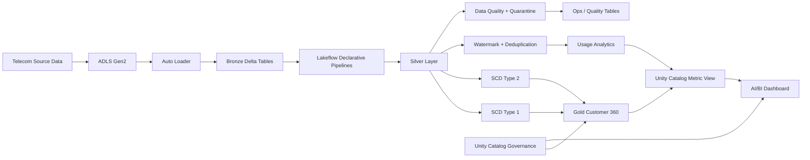

# Enterprise Telecom Customer 360 & Revenue Intelligence Platform

An end-to-end Azure Databricks Lakehouse project for a synthetic telecom environment, covering incremental ingestion, CDC, SCD processing, streaming, data quality, governance, semantic metrics, and AI/BI analytics.

> **Data safety:** All customer, subscription, billing, usage, and digital-event data used in this repository is synthetic. No employer, client, or production data is included.

## Architecture



## Technology Stack

- Microsoft Azure
- Azure Data Lake Storage Gen2
- Azure Databricks
- Apache Spark / PySpark
- Delta Lake
- Unity Catalog
- Databricks Auto Loader
- Lakeflow Declarative Pipelines
- Structured Streaming
- Lakeflow Jobs
- Unity Catalog Metric Views
- AI/BI Dashboards
- Databricks System Tables

## Medallion Architecture

### Bronze

Raw telecom data is incrementally ingested into Delta streaming tables using Auto Loader.

Implemented source domains include:

- Customers
- Subscriptions
- Usage events
- Digital events
- Invoices
- Payments
- Plans
- Regions
- Cell towers

The ingestion layer includes explicit schemas, rescued-data handling, metadata capture, incremental file processing, and Delta Change Data Feed where required.

### Silver

The Silver layer performs cleansing, validation, CDC, deduplication, and streaming transformations.

Key capabilities:

- Customer CDC
- Subscription CDC
- SCD Type 1 current-state processing
- SCD Type 2 historical tracking
- AUTO CDC
- Data-quality expectations
- Quarantine tables
- Structured Streaming
- Event-time watermarking
- Duplicate-event handling
- Semi-structured VARIANT processing
- Nested JSON extraction

### Gold

Curated analytical data products include:

- `customer_360`
- `billing_summary`
- `usage_5m`
- `usage_by_region`

The `customer_360` data product combines customer, subscription, plan, and commercial attributes for downstream analytics.

## CDC and SCD Validation

Synthetic customer changes were intentionally delivered out of order to validate sequence-aware CDC behavior.

The implementation demonstrates:

- New records
- Updates
- Deletes
- Late-arriving changes
- Out-of-order sequencing
- SCD Type 1 current-state handling
- SCD Type 2 historical tracking

A separate Delta Change Data Feed demonstration validates:

- `insert`
- `update_preimage`
- `update_postimage`
- `delete`

## Streaming and Late-Event Handling

Usage-event processing demonstrates event-time streaming concepts using:

- Structured Streaming
- 10-minute watermark
- Deduplication within watermark
- Late-event handling
- Incremental aggregation

A deliberately late usage event was excluded while a valid later event was processed successfully.

## Managed Auto Loader File Events

Managed file events were tested independently from the main pipeline to avoid coupling experimental event-notification behavior to the core workload.

The test verified incremental discovery of an ADLS Gen2 file finalized with an explicit `FlushWithClose` event.

Implementation:

```text
pipeline/05_file_events_probe.py
```

## Data Quality

Lakeflow expectations validate records before downstream processing. Invalid records are routed to quarantine tables instead of being silently discarded.

Examples include:

- Customer ID validation
- Email validation
- Sequence validation
- Subscription validation
- Usage-event validation
- Digital-event validation

## Semi-Structured Data with VARIANT

Digital events contain evolving nested JSON payloads. The project uses Databricks VARIANT functionality to safely process schema evolution and nested attributes such as campaign and geographic information.

## Unity Catalog Governance

Implemented governance capabilities include:

- Catalog and schema organization
- Storage credential and external location
- Governed tags
- Data classification
- Column-level PII tagging
- ABAC column masking
- Table and column lineage validation

The customer email column is tagged as PII and masked through an ABAC policy. Downstream dashboard users see:

```text
***MASKED***
```

instead of the underlying email value.

## Semantic Layer

A Unity Catalog Metric View provides reusable business metrics including:

- Customer count
- Active subscribers
- Monthly recurring revenue
- Average monthly fee

This creates a governed semantic layer between Gold data products and downstream BI.

## AI/BI Dashboard

The published Databricks AI/BI dashboard **Telecom Customer 360 & Revenue Intelligence** includes:

- Total Customers KPI
- Active Subscribers KPI
- Monthly Recurring Revenue KPI
- Average Monthly Fee KPI
- Revenue by Region
- Customers by Region
- Customer 360 detail table

The dashboard queries the Metric View and governed Gold data while preserving ABAC masking.

## Verified Business Results

The final synthetic validation produced:

| Metric | Result |
|---|---:|
| Customers | 3 |
| Active subscribers | 2 |
| Monthly recurring revenue | 1698 |
| Average active monthly fee | 849 |

## Repository Structure

```text
azure-telecom-customer360/
├── dashboard/
│   └── telecom_customer360.lvdash.json
├── pipeline/
│   ├── 01_bronze.py
│   ├── 02_cdc.py
│   ├── 03_streaming.py
│   ├── 04_gold.py
│   └── 05_file_events_probe.py
├── .gitignore
└── README.md
```

## Implementation Status

| Capability | Status |
|---|---|
| ADLS Gen2 | Implemented and tested |
| Unity Catalog | Implemented and tested |
| Auto Loader | Implemented and tested |
| Delta Lake | Implemented and tested |
| Bronze / Silver / Gold | Implemented and tested |
| Lakeflow Declarative Pipelines | Implemented and tested |
| AUTO CDC | Implemented and tested |
| SCD Type 1 | Implemented and tested |
| SCD Type 2 | Implemented and tested |
| Structured Streaming | Implemented and tested |
| Watermark / deduplication | Implemented and tested |
| Delta Change Data Feed | Implemented and tested |
| VARIANT | Implemented and tested |
| Data-quality expectations | Implemented and tested |
| Quarantine handling | Implemented and tested |
| Managed File Events | Implemented and tested |
| Unity Catalog lineage | Implemented and tested |
| Governed tags / ABAC masking | Implemented and tested |
| Metric View | Implemented and tested |
| AI/BI Dashboard | Implemented, tested, and published |
| System-table cost monitoring | Implemented |
| Declarative Automation Bundles | Planned |
| CI/CD | Planned |
| Automated tests | Planned |
| Azure Event Hubs live ingestion | Optional future extension |
| Genie | Optional future extension |

## Design Principles

The project follows production-oriented engineering practices:

- Incremental processing instead of unnecessary full reloads
- Idempotent pipeline behavior
- Data-quality enforcement and quarantine
- Separation of raw, cleansed, and curated layers
- Historical change tracking
- Event-time correctness for streaming
- Centralized governance and lineage
- Reusable semantic metrics
- Cost-aware serverless execution
- Synthetic data for safe portfolio demonstration

## Author

**Vishnu Deva Dubey**  
Azure Databricks / Data Engineering Portfolio Project
